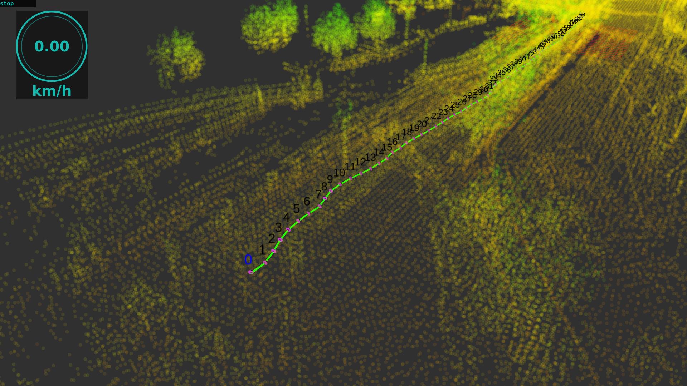

# waypoint_tools
waypointの読み書きなどwaypointに関連するノード全般

#### waypoint marking



---
## Dependency

* 必要パッケージは[rosenv](https://github.com/hrjp/rosenv/blob/main/package_install.bash)
* docker imageを利用する場合[naviton](https://github.com/KobeKosenRobotics/naviton)

```bash
git clone https://github.com/hrjp/rosenv
./rosenv/package_install.bash
```

---
## 3d_initial_pose
2D Pose Estimate を3Dに拡張するノード
### publisher
* /initialpose [geometry_msgs::PoseWithCovarianceStamped]
* /initialpose_candidate [geometry_msgs::PoseStamped]
### subscriber
* /move_base_simple/goal[geometry_msgs::PoseStamped]
* /initialpose_z [std_msgs::Float32]
* buttons [std_msgs::Int32]
### parameter
none

---

## path_number
pathを読んでwaypointの番号をmarkerarrayで配信する可視化用ノード  
waypoint/nowにあわせてmarkerの色を変える
### publisher
* waypoint/marker [visualization_msgs::MarkerArray]
### subscriber
* waypoint/now [std_msgs::Int32]
* waypoint/path [nav_msgs::Path]
### parameter
none

---

## wp_control
外部から操作によるnow way pointの更新を管理
### publisher
* waypoint/set [std_msgs::Int32]
* /initialpose [geometry_msgs::PoseWithCovarianceStamped]
### subscriber
* waypoint/now [std_msgs::Int32]
* waypoint/path [nav_msgs::Path]
* buttons [std_msgs::Int32]
### parameter
none

---

## wp_loader
wpをcsvから読み込んでpathとmarkerarrayで配信する  
waypoint/nowにあわせてmarkerの色を変える
### publisher
* waypoint/path [nav_msgs::Path]
* waypoint/type [std_msgs::Int32MultiArray]
### subscriber
none
### parameters
* map_frame [string] (default : map)

---

## wp_tracer
startボタンがおされたらmap->base_linkの距離を監視して決められた距離動くたびにnav_msgs/Pathに記録する
### publisher
* waypoint/path [nav_msgs::Path]
* waypoint/now [std_msgs::Int32]
### subscriber
* buttons [std_msgs::Int32]
### parameter
* map_frame_id [string] (default : map)
* base_link_frame_id [string] (default : base_link)
* waypoint_pitch [double] (default : 1.0)
* loop_rate [double] (default : 10.0)

---

## wp_select
位置情報からpublishするtarget way pointとなるpose を選ぶ
### publisher
* nowWpPose [geometry_msgs::PoseStamped]
* waypoint/now [std_msgs::Int32]
* mode_select/mode [std_msgs::String]
### subscriber
* waypoint/set [std_msgs::Int32]
* path [nav_msgs::Path]
* successPlan [std_msgs::Bool]
* buttons [std_msgs::Int32]
### parameter
* map_frame_id [string] (default : map)
* base_link_frame_id [string] (default : base_link)
* loop_rate [double] (default : 10.0)
* target_deviation [double] (default : 0.5)
* final_target_deviation [double] (default : 0.1)
* maxVelocity [double] (default : 1.0)

---

## wp_recoder
waypoint/pathをcsvファイルに保存して書き出す
### publisher
none
### subscriber
* path [nav_msgs::Path]
### parameter
* wp_dir [string] waypointを保存するディレクトリ


---
## Kobe Kosen Robotics Navigation Packages
* [naviton](https://github.com/KobeKosenRobotics/naviton)
    * kobe kosen roboticsの自律移動ロボットnavitonの環境構築
* [kcctcore](https://github.com/hrjp/kcctcore)
    * 各パッケージをつなぐマスターパッケージ
* [kcctnavigation](https://github.com/hrjp/kcctnavigation)
    * 自律移動用アルゴリズム全般
* [waypoint_tools](https://github.com/hrjp/waypoint_tools)
    * waypointの読み書きなどwaypointに関連するノード全般
* [kcctsim](https://github.com/hrjp/kcctsim)
    * gazebo simulationとrobotのURDFモデル
* [kcctplugin](https://github.com/hrjp/kcctplugin)
    * 自律移動用のrviz plugin
* [kcctfirm](https://github.com/hrjp/kcctfirm)
    * 自律移動ロボットNavitonのファームウェア
* [LeGO-LOAM](https://github.com/hrjp/LeGO-LOAM)
    * 3D Mapping
    * forked from [LeGO-LOAM](https://github.com/RobustFieldAutonomyLab/LeGO-LOAM)
